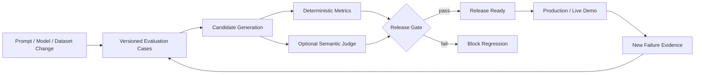

<p align="center">
  <a href="https://prompt-pulse.streamlit.app/">
    
  </a>
</p>

<h1 align="center">PromptPulse</h1>

<p align="center">
  <strong>Continuous LLM Evaluation & Release Gating</strong><br>
  Production-oriented LLM quality pipeline that turns chatbot behavior into repeatable release gates across relevance, groundedness, reference coverage and policy compliance.
</p>

<p align="center">
  <a href="https://prompt-pulse.streamlit.app/"><strong>Live Demo ↗</strong></a> ·
  <a href="#architecture"><strong>Architecture</strong></a> ·
  <a href="#quality-gates"><strong>Quality Gates</strong></a> ·
  <a href="#cicd"><strong>CI/CD</strong></a>
</p>

<p align="center">
  <a href="https://github.com/h00w/PromptPulse/actions/workflows/ai_evals.yml"></a>
  
  
  
</p>

---

## Why PromptPulse exists

Traditional unit tests verify deterministic software. LLM applications also need **behavioral tests**: after a prompt, model, retrieval, or application change, does the system remain relevant, grounded, policy-compliant, and complete enough for release?

PromptPulse turns those questions into a repeatable engineering loop:

> **Measure → Compare → Gate → Improve → Release**

The project combines dataset-driven evaluation, live Hugging Face inference, fast deterministic gates, optional DeepEval semantic judging, GitHub Actions, and a Streamlit evaluation dashboard.

## Architecture



## What is evaluated

| Metric | Purpose | Release signal |
| --- | --- | --- |
| Answer relevance | response addresses the user query | regression indicator |
| Groundedness | response stays within approved context | critical quality signal |
| Reference coverage | required source information is represented | completeness signal |
| Policy compliance | required terms present, prohibited terms absent | deterministic blocker |
| Pulse score | weighted aggregate | overall comparison signal |
| DeepEval judge | optional semantic evaluation | supporting evidence |

The deterministic checks remain transparent and reproducible. Semantic judging is supplemental rather than unquestioned release authority.

## Evaluation flow

1. Select a versioned scenario.
2. Load the user query, approved reference context, and expected behavior.
3. Generate a response with the configured Hugging Face model.
4. Calculate deterministic quality metrics.
5. Optionally run DeepEval when judge credentials are available.
6. Apply the release threshold.
7. Preserve failure evidence as the basis for the next regression case.

## Live evaluation experience

The Streamlit application is designed around evaluation rather than a generic chatbot UI. A reviewer can:

- choose an evaluation scenario;
- inspect approved reference context;
- select a Hugging Face model and generation settings;
- run live inference;
- inspect relevance, groundedness, reference coverage, policy compliance and Pulse score; and
- review the raw model response and reasons behind the score.

If `HF_TOKEN` is absent, deterministic demo responses keep the evaluation interface explorable without exposing credentials.

## Quality gates

### Deterministic layer

Fast checks run in CI without a paid judge API. These include relevance, grounding, reference coverage, required/forbidden term rules and the aggregate Pulse score.

### Optional semantic layer

When `OPENAI_API_KEY` is configured, DeepEval can add semantic metrics such as answer relevancy and hallucination checks against trusted context.

The semantic layer is optional by design: CI remains reproducible even when external judge credentials are unavailable.

## CI/CD

`.github/workflows/ai_evals.yml` runs evaluation on pushes and pull requests:

- install pinned dependencies;
- validate the evaluation dataset;
- run deterministic quality gates;
- run optional DeepEval tests when configured;
- validate application imports; and
- publish test artifacts.

A failed quality gate blocks the regression from being treated as release-ready.

## Evaluation dataset

Scenarios live in `tests/test_dataset.json`, allowing new regression cases without changing evaluation code.

Each record can contain:

- scenario ID;
- user query;
- approved reference context;
- expected answer;
- required terms; and
- forbidden terms.

This makes evaluation assets versionable alongside the application code.

## Security and credential boundaries

- no tokens are committed to the repository;
- secrets are read from environment variables or Streamlit secrets;
- local secrets are gitignored;
- token values are never printed;
- runtime inference and CI deployment can use separate least-privilege credentials.

## Run locally

```bash
git clone https://github.com/h00w/PromptPulse.git
cd PromptPulse
python -m venv .venv
pip install -r requirements-dev.txt
python -m pytest -q
streamlit run app/app.py
```

For live Hugging Face inference:

```bash
export HF_TOKEN="your_token"
streamlit run app/app.py
```

## Production evolution

Natural extensions include:

- multi-turn benchmark cases;
- prompt/model baseline-vs-candidate comparison;
- latency and cost budgets;
- RAG faithfulness checks;
- historical run storage;
- PR annotations for failed scenarios;
- production trace ingestion; and
- observability integration.

## Proof chain

**Dataset → Inference → Deterministic Evaluation → Semantic Evidence → CI Gate → Live Dashboard → Regression Learning**

- Live demo: https://prompt-pulse.streamlit.app/
- GitHub Actions: https://github.com/h00w/PromptPulse/actions/workflows/ai_evals.yml
- Evaluation source: [`tests/test_dataset.json`](tests/test_dataset.json)
- Evaluation engine: [`promptpulse/evaluation.py`](promptpulse/evaluation.py)

## Author

**Hendarmawan, PhD Eng.**  
LLMOps · AI Evaluation · Production AI · Release Engineering · AI Governance

[Website](https://hendarmawan.se) · [LinkedIn](https://www.linkedin.com/in/hender/) · [GitHub](https://github.com/h00w)

## License

MIT
