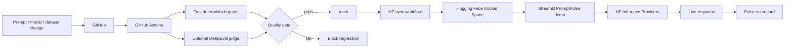

# ⚡ PromptPulse

**Continuous evaluation and release gating for LLM chatbots.**

PromptPulse is a production-oriented evaluation pipeline for testing chatbot quality before prompt, model, or application changes reach users. It combines dataset-driven QA, Hugging Face inference, fast deterministic gates, optional DeepEval LLM-as-a-judge evaluation, GitHub Actions, and a live Streamlit dashboard.

[](https://github.com/h00w/PromptPulse/actions/workflows/ai_evals.yml)
[](https://github.com/h00w/PromptPulse/actions/workflows/hf_sync.yml)
[](https://www.python.org/)
[](LICENSE)

## Why this project exists

Traditional unit tests verify deterministic software. LLM applications also need **behavioral tests**: does the answer remain relevant, grounded in approved context, complete enough to satisfy policy, and free from prohibited content after a prompt or model change?

PromptPulse turns those checks into a repeatable release gate.

### What it demonstrates

- **Dataset-driven evaluation** — QA scenarios live in `tests/test_dataset.json`; adding a case requires no Python changes.
- **Hugging Face inference** — live generations use `huggingface_hub.InferenceClient` and Inference Providers instead of downloading multi-GB model weights into CI.
- **Fast CI gates** — deterministic lexical/grounding/policy metrics run on every push and pull request.
- **Optional DeepEval judge** — when `OPENAI_API_KEY` is configured, CI also runs DeepEval Answer Relevancy and Hallucination metrics.
- **Interactive evaluation demo** — visitors can choose a scenario, adjust generation controls, run a model, inspect the response, and see the quality scorecard.
- **Automated deployment** — pushes to `main` sync this repository to the Hugging Face Docker Space `h0000w/PromptPulse`.
- **Portable frontend** — the same `app/app.py` runs on Hugging Face Spaces or Streamlit Community Cloud.

## Architecture



## Repository layout

```text
.
├── .github/workflows/
│   ├── ai_evals.yml
│   └── hf_sync.yml
├── .streamlit/config.toml
├── app/app.py
├── promptpulse/
│   ├── __init__.py
│   ├── config.py
│   ├── data.py
│   ├── evaluation.py
│   └── inference.py
├── tests/
│   ├── test_dataset.json
│   ├── test_evaluation.py
│   └── test_deepeval.py
├── Dockerfile
├── requirements.txt
├── requirements-dev.txt
└── README.md
```

## Live demo

The demo is designed around evaluation rather than a generic chat UI.

1. Pick an evaluation scenario from the sidebar.
2. Review the approved reference context and expected behavior.
3. Choose a Hugging Face model and generation settings.
4. Click **Run Live Evaluation**.
5. PromptPulse generates an answer, evaluates it, and displays:
   - **Answer relevance**
   - **Groundedness**
   - **Reference coverage**
   - **Policy compliance**
   - **Overall Pulse score**
6. Inspect reasons and the raw response.

If `HF_TOKEN` is not available, the app automatically falls back to deterministic demo responses so the dashboard remains explorable.

## Quick start

```bash
git clone https://github.com/h00w/PromptPulse.git
cd PromptPulse

python -m venv .venv
source .venv/bin/activate        # Windows: .venv\Scripts\activate

pip install -r requirements-dev.txt
pytest -q
streamlit run app/app.py
```

For live Hugging Face inference:

```bash
export HF_TOKEN="your_token"
streamlit run app/app.py
```

Optional environment variables:

```bash
export PROMPTPULSE_MODEL="Qwen/Qwen2.5-7B-Instruct-1M"
export PROMPTPULSE_PROVIDER="auto"
```

## Evaluation dataset

Every record in `tests/test_dataset.json` has an ID, scenario, user query, approved reference context, expected answer, and optional required/forbidden terms.

```json
{
  "id": "refund-policy",
  "scenario": "Refund policy",
  "user_query": "Can I return an unused product after 20 days?",
  "reference_context": "Unused products may be returned within 30 days of purchase for a full refund.",
  "expected_answer": "Yes. An unused product returned 20 days after purchase is within the 30-day return window.",
  "required_terms": ["30 days"],
  "forbidden_terms": ["60 days"]
}
```

## Quality gates

PromptPulse uses two layers.

### 1. Fast deterministic gates

These always run in CI and require no paid judge API:

| Metric | Meaning | Direction |
|---|---|---|
| Answer relevance | Query terms represented in the response | Higher is better |
| Groundedness | Response claims overlap approved context | Higher is better |
| Reference coverage | Approved context represented in the response | Higher is better |
| Policy compliance | Required terms present and forbidden terms absent | Higher is better |
| Pulse score | Weighted aggregate | Higher is better |

These gates are intentionally transparent and deterministic. They are regression indicators, not replacements for semantic LLM judges.

### 2. Optional DeepEval judge

If `OPENAI_API_KEY` exists in GitHub Secrets, `tests/test_deepeval.py` runs DeepEval:

- `AnswerRelevancyMetric`
- `HallucinationMetric` using trusted `context`

The tests skip cleanly when the judge key is absent.

## CI/CD

### AI evaluation workflow

`.github/workflows/ai_evals.yml` runs on pushes and pull requests:

- installs Python dependencies
- validates the JSON dataset
- runs unit and deterministic evaluation gates
- optionally runs DeepEval when a judge key is configured
- uploads the evaluation report as an artifact

### Hugging Face deployment workflow

`.github/workflows/hf_sync.yml` runs only after `AI Evals` succeeds on `main`.

It:

1. checks out the tested commit,
2. ensures the Space `h0000w/PromptPulse` exists,
3. pushes the exact commit to the Hugging Face Space.

Required GitHub repository secret:

- `HF_TOKEN` — Hugging Face token with permission to create/write the Space.

> `GITHUB_SYNC_TOKEN` on Hugging Face is not required for the GitHub → Hugging Face deployment direction used here.

## Deploy to Hugging Face Spaces

PromptPulse uses **Docker SDK + Streamlit**, which is the current recommended Hugging Face pattern for Streamlit apps.

Manual setup is optional because the workflow can create the Space automatically. If you create it yourself, use:

- Owner: `h0000w`
- Space name: `PromptPulse`
- SDK: `Docker`
- App port: `7860`

Then add the Space secret:

- `HF_TOKEN` if you want the running demo to call Hugging Face Inference Providers.

The repository sync token and the runtime inference token can be the same token if its permissions are appropriate, but separate least-privilege tokens are preferable in a production organization.

## Deploy to Streamlit Community Cloud

This repo is also directly deployable at Streamlit Community Cloud:

- Repository: `h00w/PromptPulse`
- Branch: `main`
- Main file: `app/app.py`

Add `HF_TOKEN` in **App settings → Secrets** for live inference.

### Recommended hosting

**Primary demo: Hugging Face Spaces.** It puts an AI evaluation project in the ecosystem recruiters and ML engineers expect and keeps the model/inference story close to the application.

**Secondary mirror: Streamlit Community Cloud.** Useful as a backup URL and for fast Streamlit-native operations.

## Security

- No tokens are committed to the repository.
- Secrets are read only from environment variables or Streamlit secrets.
- The app does not print token values.
- User input is sent to the configured inference provider only when live inference is enabled.
- GitHub Actions uses repository secrets.
- Production systems should use separate, least-privilege tokens for CI deployment and runtime inference.

## Extending PromptPulse

Natural next steps:

- add multi-turn conversation datasets
- add latency and cost budgets
- persist historical runs to Postgres / DuckDB
- add prompt-version comparison
- add RAG faithfulness metrics
- export JUnit/JSON reports to an observability platform such as Langfuse
- add PR annotations for failed scenarios
- add model/provider A/B comparison

## License

MIT
